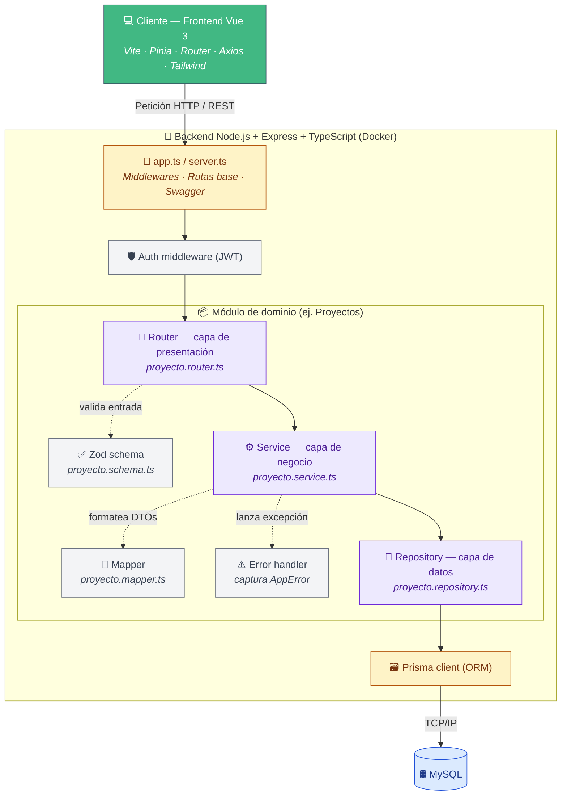

# Sistema de Gestión de Proyectos Académicos (e2_backend)

Este proyecto consta de un **Backend** (API con Node.js, Express y Prisma) y un **Frontend** (Vue.js con Vite).

## Cómo ejecutar el proyecto

Para correr el proyecto completo, necesitas abrir **dos terminales** diferentes:

### 1. Iniciar el Backend
Desde la raíz del proyecto, ejecuta:
```bash
cd backend
npm run dev
```
*   **Puerto:** [http://localhost:3001](http://localhost:3001)
*   **Documentación API:** [http://localhost:3001/api-docs](http://localhost:3001/api-docs)

### 2. Iniciar el Frontend
Desde la raíz del proyecto, en otra terminal, ejecuta:
```bash
cd frontend
npm run dev
```
*   **Puerto:** Generalmente [http://localhost:5173](http://localhost:5173) (o el que indique la terminal si el 5173 está ocupado).

---

## Requisitos Previos
- **Node.js** instalado.
- **MySQL** corriendo con la base de datos `gestor_proyectos` creada (configurada en `backend/.env`).
- Ejecutar `npm install` en ambas carpetas (`backend` y `frontend`) la primera vez.

## Scripts Útiles (Backend)
- `npm run seed`: Para poblar la base de datos con datos de prueba iniciales.
- `npx prisma studio`: Para ver y editar los datos de la base de datos visualmente.

## Arquitectura del Sistema

El backend sigue una arquitectura multicapa modular estructurada de la siguiente manera:


